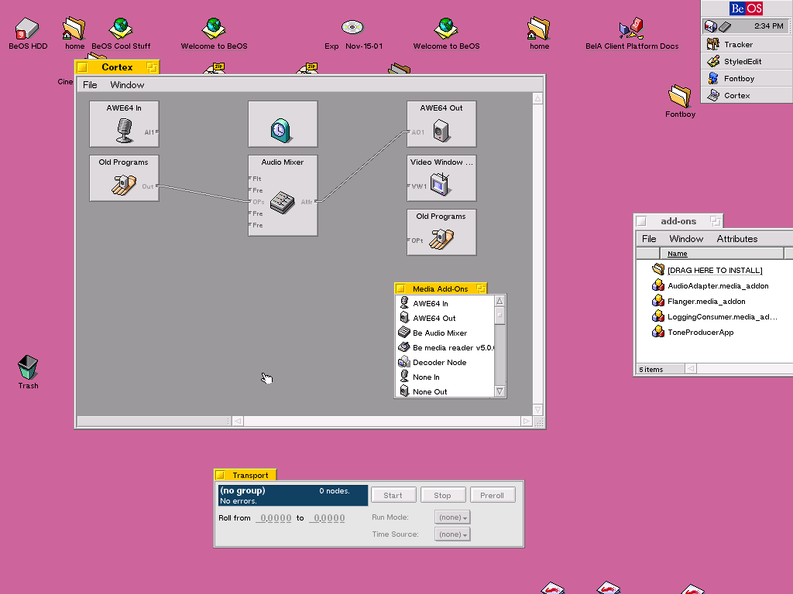

# Cortex

> This is an early release of Cortex; the BeOS Media Kit is still young. The tools provided with Cortex will change as the Media Kit's capabilities are refined.

**Short Answer**: Cortex lets you mess with media nodes.

If you don't know what a BeOS media node is, Cortex probably won't be of much use to you -- yet. Media nodes are the building blocks with which you can read, write, and mangle media (audio and video so far, with other flavors on the horizon.) A media node might represent an application (like a sound player) or a hardware device (such as a video-capture card.) A component of the BeOS called the Media Roster keeps track of all the nodes in the system, maintains connections between them, and generally acts as the backbone of a software media network.

**Precise Answer**: Cortex provides a user-interface (UI) to the Media Roster.

Say you have a bunch of audio nodes lying fallow in your `/boot/home/config/add-ons/media` folder. Some of them make noise, other ones filter it. While nodes will often be provided as parts of full-fledged applications, the BeOS Media Kit is designed to let you mix and match them to your heart's content: there are no competing 'plug-in' formats to worry about.

However, the BeOS provides no direct user interface to the Media Roster. This is understandable, since at this point there are very few media nodes in circulation (beyond device drivers, which generally require no UI at all.)

If you are a software developer working with media nodes, **Cortex** provides you with a basic test platform. Its UI allows you to simply and quickly chain different combinations of nodes. Watch for developer-friendly testing/diagnostic features in upcoming releases. The next couple of releases will also introduce an API to allow anybody to make use of Cortex's node- and connection-management facilities, which simplify such tasks as starting and stopping sets of connected nodes. 